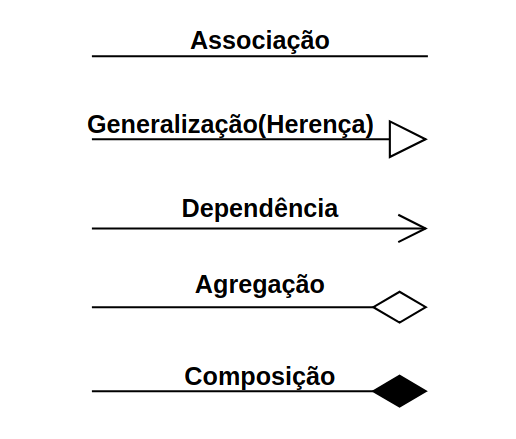
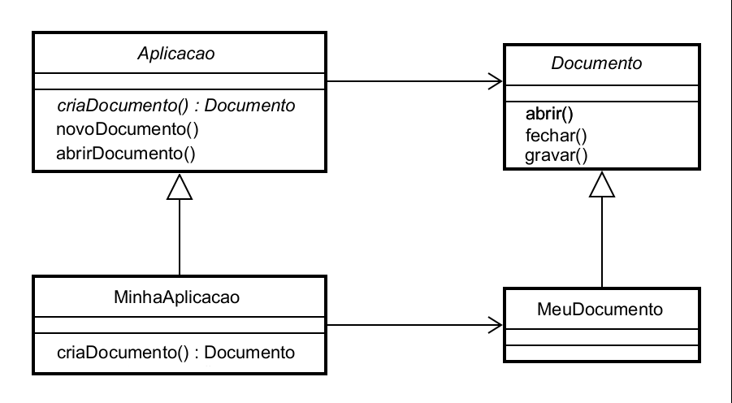
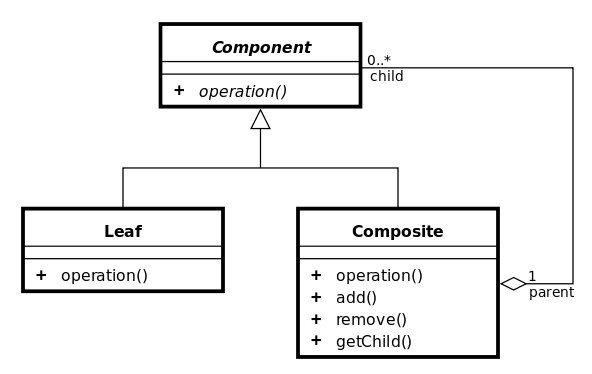
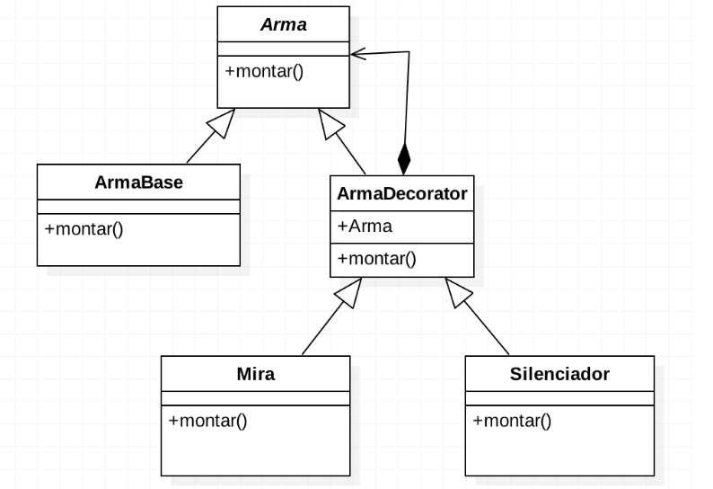
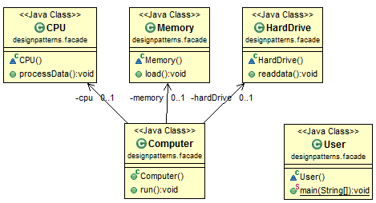
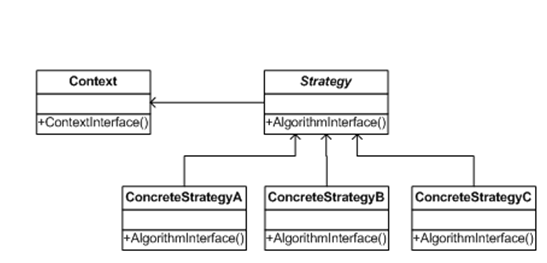
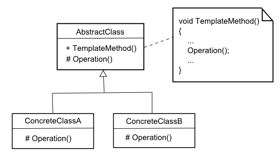

# Conceitos de Orientação
## **Herança**

Classe Pessoa:
```java
public class Pessoa {
    public String nome;
    public String cpf;
    public Date data_nascimento;
     
    public Pessoa(String _nome, String _cpf, Date _data) {
        this.nome = _nome;
        this.cpf = _cpf;
        this.data_nascimento = _data;
    }
}
```
Classe Aluno, herda de Pessoa: 

```java
public class Aluno extends Pessoa {
    public Aluno(String _nome, String _cpf, Date _data) {
        super(_nome, _cpf, _data);
    }
    public String matricula;
}
```

## **Sobrescrita de Método**
Sobrescrita do método **getBonificação**

```java
public class Funcionario {
        protected String nome;
        protected String cpf;
        protected double salario;

        public double getBonificacao() {
            return this.salario * 0.10;
        }
        // métodos
    }
 
public class Gerente extends Funcionario {
        int senha;
        int numeroDeFuncionariosGerenciados;

        @Override // A anotaçao overide é opcional
        public double getBonificacao() {
            return this.salario * 0.15;
        }
        // ...
    }
```
## **Classes Abstratas**
As classes abstratas são as que **não permitem realizar qualquer tipo de instância**. São classes feitas especialmente para serem modelos para suas classes derivadas. As classes derivadas, via de regra, **deverão sobrescrever os métodos** para realizar a implementação dos mesmos. As classes derivadas das classes abstratas são conhecidas como **classes concretas**.

Classe abstrata:
```java
public abstract class Funcionario
     {
         public string Nome;
         public decimal Salario;
   
         public abstract void Reajustar();
     }
```
Classe que herda de uma abstrata precisa obrigatoriamente implementar os métodos abstratos:
```java
public class Programador : Funcionario
     {
         public override void Reajustar()
         {
             Salario += 1000;
         }
     }
```

## **Interface**

A interface é um recurso muito utilizado em Java, bem como na maioria das linguagens orientadas a objeto, para “obrigar” a um determinado grupo de classes a ter métodos ou propriedades em comum para existir em um determinado contexto.


Interface FiguraGeometrica:
```java
public interface FiguraGeometrica
{
 public String getNomeFigura(); 
 public int getArea();
 public int getPerimetro();
}
```
Classe Quadrado:
```java
public class Quadrado implements FiguraGeometrica {
 
    private int lado;
 
    //gets e sets de lado ....
        
    //metodos da interface     
    @Override
    public int getArea() {
        int area = 0;
        area = lado * lado;
 
        return area;
    }
 
    @Override
    public int getPerimetro() {
        int perimetro = 0;
 
        perimetro = lado * 4;
        return perimetro;
    }
 
    @Override
    public String getNomeFigura() {
        return "quadrado";
    }
}
```

------------------------------------------------

# UML

## **Relações:**


### **1. Associação**
São relacionamentos estruturais entre instâncias e especificam que objetos de uma classe estão ligados a objetos de outras classes. Podemos ter associação uniaria , binária , etc.

### **2. Generalização(Herença)**
Relacionamento entre um elemento mais geral e um mais específico. Onde o elemento mais específico herda as propriedades e métodos do elemento mais geral. 

### **3. Generalização(Herença)**
São relacionamentos de utilização no qual uma mudança na especificação de um elemento pode alterar a especificação do elemento dependente. A dependência entre classes indica que os objetos de uma classe usam serviços dos objetos de outra classe.

### **4. Agregação**
tipo de associação ( é parte de , todo/parte) onde o objeto parte é um atributo do todo ; onde os objetos partes somente são criados se o todo ao qual estão agregados seja criado. Ex: Mão é formada por dedos da mão.

###  **5. Composição**
Relacionamento entre um elemento ( o todo) e outros elementos (as partes) onde as parte só podem pertencer ao todo e são criadas e destruídas com ele.


# **Padrões GOF**

Template MEthod
Strategy
Composite
Abstract Factory
MethodFactory

## **1. Criacionais**

### **1.1 Factory Method**

Permite às classes delegar para subclasses decidirem, isso é feito através da criação de objetos que chamam o método fabrica especificado numa interface e implementado por um classe filha ou implementado numa classe abstrata e opcionalmente sobrescrito por classes derivadas.



Exemplo código Factory Method:

*produtos abstratos e concretos*
```java
public abstract class Pessoa {
 
    public String nome;
    public String sexo;
 
}
 
class Homem extends Pessoa {
     
    public Homem(String nome) {
        this.nome = nome;
        System.out.println(“Olá Senhor ” + this.nome);
    }
}
 
class Mulher extends Pessoa {
     
    public Mulher(String nome) {
        this.nome = nome;
        System.out.println(“Olá Senhora ” + this.nome);
    }
 
}
```

*implementaçaõ do factory method*

```java
class FactoryPessoa {
 
    public Pessoa getPessoa(String nome, String sexo) {
        if (sexo.equals(“M”))
            return new Homem(nome);
        if (sexo.equals(“F”))
            return new Mulher(nome);
    }
 
}
```

*execução*
```java
public class TesteApp {
     
    public static void main(String args[]) {
        FactoryPessoa factory = new FactoryPessoa();
        String nome = “Carlos”;
        String sexo = “M”;
        factory.getPessoa(nome, sexo);
    }
}
```
### **1.2 Builder**

Builder é útil quando se há vários atributos que precisam
ser inicializados no construtor.
 
O padrão Builder é um padrão de projetos de software comum que é usado para encapsular
a lógica de construção de um objeto. Este padrão é frequentemente utilizado quando o
processo de construção de um objeto é considerado complexo e também é adequado quando
se trata da construção de representações múltiplas de uma mesma classe.


Exemplo de código:

*Product*
```java
class Pizza {
    private String sauce = "";
    private String topping = "";

    public void setSauce(String sauce) {
        this.sauce = sauce;
    }

    public void setTopping(String topping) {
        this.topping = topping;
    }
}
```

*Builder*
```java
abstract class PizzaBuilder {
    protected Pizza pizza;

    public Pizza getPizza() {
        return pizza;
    }

    public void createNewPizzaProduct() {
        pizza = new Pizza();
    }

    public abstract void buildSauce();
    public abstract void buildTopping();
}
```

*Concrete Builder*
```java
class SpicyPizzaBuilder extends PizzaBuilder {
    public void buildSauce() {
        pizza.setSauce("hot");
    }

    public void buildTopping() {
        pizza.setTopping("pepperoni+salami");
    }
}
```

*Director*
```java
class Waiter {
    private PizzaBuilder pizzaBuilder;

    public void setPizzaBuilder(PizzaBuilder pb) {
        pizzaBuilder = pb;
    }

    public Pizza getPizza() {
        return pizzaBuilder.getPizza();
    }

    public void constructPizza() {
        pizzaBuilder.createNewPizzaProduct();
        pizzaBuilder.buildSauce();
        pizzaBuilder.buildTopping();
    }
}
```

*Execução*
```java
public class PizzaBuilderDemo {
    public static void main(String[] args) {
        Waiter waiter = new Waiter();
        PizzaBuilder spicyPizzaBuilder = new SpicyPizzaBuilder();

        waiter.setPizzaBuilder( spicyPizzaBuilder );
        waiter.constructPizza();

        Pizza pizza = waiter.getPizza();
    }
}
```

## **2. Estruturais**

### **2.1 Adapter**

Permitir que um objeto seja substituído por outro que, apesar de realizar a mesma tarefa, possui uma interface diferente.


Exemplo código adapter:

Adaptador de entrada
```java
//Classe adaptada(Adaptee)
class EntradaPS2 {

    //Solicitação Especifica
    public void conectarEntradaPS2() {
        System.out.println("Conectado na entrada PS2");
    }
}

//Classe alvo(Target)
class EntradaUSB {

    //Solicitação
    public void conectarEntradaUSB() {
        System.out.println("Conectado na entrada USB");
    }
}

//Classe adaptador(Adapter)
class AdapterEntrada extends EntradaUSB {

    private EntradaPS2 entradaPS2;

    public AdapterEntrada(EntradaPS2 entradaPs2) {
        this.entradaPS2 = entradaPs2;
    }

    //Solicitação
    public void conectarEntradaUSB() {
        entradaPS2.conectarEntradaPS2();
    }
}

//Classe Cliente(Client)
public class Teclado {

    public static void main(String[] args) {
        EntradaPS2 ps2 = new EntradaPS2();
        AdapterEntrada adaptador = new AdapterEntrada(ps2);
        adaptador.conectarEntradaUSB();
    }
}
}
```
### **2.2 Composite**
Padrão de projeto de software utilizado para representar um objeto formado pela composição de objetos similares. Este conjunto de objetos pressupõe uma mesma hierarquia de classes a que ele pertence. Tal padrão é, normalmente, utilizado para representar listas recorrentes - ou recursivas - de elementos.



Exemplo de código composite:

*component*
```java
public interface Stretch {
	
	public void printStretch();
}
```

*leaf 1*
```java
public class StretchByCar implements Stretch {
	
	private String direction;

	public StretchByCar(String direction, double distance){
		this.direction = direction;
	}
	
	@Override
	public void printStretch() {
		System.out.println("Go by Car: ");
		System.out.println(this.direction);
	}
	
}
```
*leaf 2*
```java
public class StretchByFoot implements Stretch {
	
	private String direction;

	public StretchByFoot(String direction, double distance){
		this.direction = direction;
	}
	
	@Override
	public void printStretch() {
		System.out.println("Go by Foot: ");
		System.out.println(this.direction);
	}
}
```
*leaf 3*
```java
public class StretchBySubway implements Stretch {
	
	private String direction;

	public StretchBySubway(String direction, double distance){
		this.direction = direction;
	}
	
	@Override
	public void printStretch() {
		System.out.println("Go by Subway: ");
		System.out.println(this.direction);
	}
	
}
```
*composite*

```java
public class Path implements Stretch {
	
	private List <Stretch> stretches = new ArrayList <Stretch>();
	
	public void addStretch(Stretch stretch){
		this.stretches.add(stretch);
	}
	
	public void removeStretch(Stretch stretch){
		this.stretches.remove(stretch);
	}
	
	@Override
	public void printStretch() {
		for(Stretch stretch : this.stretches){
			stretch.printStretch();
		}
	}
}
```

*execução*
```java
public class CompositeTest {

	public static void main(String[] args) {
		Stretch stretch01 = new StretchByFoot("Go to Dundas Street.");
		Stretch stretch02 = new StretchByCar("Go to Main Av.");
		Stretch stretch03 = new StretchByCar("Go to Palace Square");
		Stretch stretch04 = new StretchBySubway("Go to Lincon St.");
		
		Path path1 = new Path();
		path1.addStretch(stretch01);
		path1.addStretch(stretch02);
		System.out.println("First Path: ");
		path1.printStretch();
		
		Path path2 = new Path();
		path2.addStretch(path1);
		path2.addStretch(stretch03);
		System.out.println("--------------");
		System.out.println("Second Path: ");
		path2.printStretch();
		
		Path path3 = new Path();
		path3.addStretch(path2);
		path3.addStretch(stretch04);
		System.out.println("--------------");
		System.out.println("Third Path: ");
		path3.printStretch();	
	}
}
```

### **2.3 Decorator**
Padrão de projeto de software que permite adicionar um comportamento a um objeto já existente em tempo de execução, ou seja, agrega dinamicamente responsabilidades adicionais a um objeto.[1] Decorators oferecem uma alternativa flexível ao uso de herança para estender uma funcionalidade, com isso adiciona-se uma responsabilidade ao objeto e não à classe.



Exemplo de código decorator:

*componente*
```java
public interface Arma{

  public void montar();
}
```

*component concreto*
```java
public class ArmaBase implements Arma{

  @Override
  public void montar(){
    System.out.println("Essa é uma arma base");
  }
}
```

*decorator*
```java
public class ArmaDecorator implements Arma{

  public Arma arma;

  public ArmaDecorator(Arma arma){
    this.arma = arma;
  }

  @Override
  public void montar(){
    this.arma.montar();
  }
}
```

*decorator concreto 1*
```java
public class Mira extends ArmaDecorator{

  public Mira(Arma arma){
    super(arma);
  }

  @Override
  public void montar(){
    super.montar();
    System.out.println("Adicionando mira a arma");
  }

}
```

*decorator concreto 2*
```java
public class Silenciador extends ArmaDecorator{

  public Silenciador(Arma arma){
    super(arma);
  }

  @Override
  public void montar(){
    super.montar();
    System.out.println("Adicionando silenciador a arma");
  }

}
```

*execução*
```java
/* Monta uma arma com mira e silenciador */
Arma armaCompleta = new Silenciador( new Mira( new ArmaBase() ) );
armaCompleta.montar();

/* Monta uma arma sem acessórios */
Arma armaB = new ArmaBase();
armaB.montar();

/* Monta uma arma com silenciador */
Arma armaComSilenciador = new Silenciador( armaB );
armaComSilenciador.montar();

/* Monta uma arma com mira */
Arma armaComMira = new Mira( armaB );
armaComMira.montar();
```

### **2.4 Facade**

O padrão de design da fachada oculta a complexidade de uma tarefa e fornece uma interface simples. Um bom exemplo é a inicialização de um computador. Quando um computador é iniciado, ele envolve o trabalho de cpu, memória, disco rígido, etc. Para facilitar o uso dos usuários, podemos adicionar uma fachada que envolve a complexidade da tarefa e fornecer uma interface simples.



Exemplo de código:
```java
//the components of a computer
 
class CPU {
    public void processData() { }
}
 
class Memory {
    public void load() { }
}
 
class HardDrive {
    public void readdata() { }
}
 
/* Facade */
class Computer {
    private CPU cpu;
    private Memory memory;
    private HardDrive hardDrive;
 
    public Computer() {
        this.cpu = new CPU();
        this.memory = new Memory();
        this.hardDrive = new HardDrive();
    }
 
    public void run() {
        cpu.processData();
        memory.load();
        hardDrive.readdata();
    }
}
 
 
class User {
    public static void main(String[] args) {
        Computer computer = new Computer();
        computer.run();
    }
}
```

## **3. Comportamentais**
### **3.1 Strategy**
O padrão Strategy serve para “definir uma família de algoritmos, encapsular cada uma delas e torná-las intercambiáveis. Strategy permite que o algoritmo varie independentemente dos clientes que o utilizam.
Em outras palavras, Strategy nos permite configurar uma classe com um de vários comportamentos, utilizando o conceito de OO chamado de composição.



Exemplo de código:

*contexts*
```java
public class Item {
	
	String itemCode;
	double itemPrice;
	
	public Item(String itemCode, double itemPrice){
		this.itemCode = itemCode;
		this.itemPrice = itemPrice;
	}
	
	public String getItemCode() {
		return itemCode;
	}
	
	public void setItemCode(String itemCode) {
		this.itemCode = itemCode;
	}
	
	public double getItemPrice() {
		return itemPrice;
	}
	
	public void setItemPrice(double itemPrice) {
		this.itemPrice = itemPrice;
	}
}
```
```java
public class ShoppingContext {
	
	List<Item> items;
	Payment payment;
	
	public ShoppingContext() {
		this.items = new ArrayList<Item>();
	}
	
	public void addItem(Item item) {
		this.items.add(item);
	}
	
	public void removeItem(Item item) {
		this.items.remove(item);
	}
	
	public double calculateTotalPrice() {
		double sum = 0;
		for(Item item : items) {
			sum += item.getItemPrice();
		}
		return sum;
	}
	
	public void pay(Payment payment){
		double amount = this.calculateTotalPrice();
		this.payment = payment;
		this.payment.pay(amount);	
	}
	
	//Other important typical processing for shopping context...

}
```

*strategy*
```java
public interface Payment {
	
	public void pay (double amount);

}
```

*concrete strategy 1*
```java
public class PaymentByBankingBillet implements Payment {
	
	private String bankingBilletPayerName;
	private String bankingBilletBeneficiaryName;
	private String bankingBilletNumber;

	public PaymentByBankingBillet(String bankingBilletPayerName, String bankingBilletBeneficiaryName, String bankingBilletNumber) {
		this.bankingBilletPayerName = bankingBilletPayerName;
		this.bankingBilletBeneficiaryName = bankingBilletBeneficiaryName;
		this.bankingBilletNumber = bankingBilletNumber;
	}
	
	@Override
	public void pay(double amount) {
		// Payment Strategy by using a Banking Billet
		//Here is the place to implements the details to deal with a payment by using a Banking Billet
		double formattedAmount = Double.valueOf(String.format(Locale.UK,  "%.2f", amount));
		System.out.println(formattedAmount + " paid with banking billet");
		System.out.println("The banking billet's details are:");
		System.out.println("Banking Billet's Payer Name: " + 
        this.bankingBilletPayerName);
		System.out.println("Banking Billet's Beneficiary Name: " + this.bankingBilletBeneficiaryName);
		System.out.println("Banking Billet's Number: " + 
        this.bankingBilletNumber);
	}
}
```

*concrete strategy 2*
```java
public class PaymentByCreditCard implements Payment {
	
	private String creditCardOwnerName;
	private String creditCardNumber;
	private int creditCardCheckerCode;

	public PaymentByCreditCard(String creditCardOwnerName, String creditCardNumber, int creditCardCheckerCode) {
		this.creditCardOwnerName = creditCardOwnerName;
		this.creditCardNumber = creditCardNumber;
		this.creditCardCheckerCode = creditCardCheckerCode;
	}
	
	@Override
	public void pay(double amount) {
		// Payment Strategy by using a Credit Card
		//Here is the place to implements the details to deal with a payment by using a Credit Card
		double formattedAmount = Double.valueOf(String.format(Locale.UK,  "%.2f", amount));
		System.out.println(formattedAmount + " paid with credit/debit card");
		System.out.println("The credit card's details are:");
		System.out.println("Credit Card's Owner Name: " + 
        this.creditCardOwnerName);
		System.out.println("Credit Card's Owner Number: " + 
        this.creditCardNumber);
		System.out.println("Credit Card's Owner Checker Code: " + 
        this.creditCardCheckerCode);
	}
}
```

### **3.2 Template Method**

Definir a ordem na qual determinados passos devem ser realizados na resolução de um problema e permitir que esses passos possam ser realizados de formas diferentes de acordo com a situação.



Exemplo código:

*Abstract class*
```java
public abstract class AbstractClass {
	
	public final void templateMethod(){
		operation1();
		operation2();
		operation3();
	}
	
	public abstract void operation1();
	public abstract void operation2();
	public abstract void operation3();

}
```

*Concrete class*
```java
public class ConcreteClass extends AbstractClass {

	public ConcreteClass() {
		// TODO Auto-generated constructor stub
	}

	@Override
	public void operation1() {
		// TODO Auto-generated method stub
		System.out.println("Implementing the body 
        of the operation1, specific for this ConcreteClass");

	}

	@Override
	public void operation2() {
		// TODO Auto-generated method stub
		System.out.println("Implementing the body 
        of the operation2, specific for this ConcreteClass");

	}

	@Override
	public void operation3() {
		// TODO Auto-generated method stub
		System.out.println("Implementing the body 
        of the operation3, specific for this ConcreteClass");
	}

}

```

*execução*
```java
public class TemplateMethodTest {

	/**
	 * Testing the Template Method Pattern...
	 */
	public static void main(String[] args) {
		AbstractClass generic = new ConcreteClass();
		generic.templateMethod();

	}

}
```
